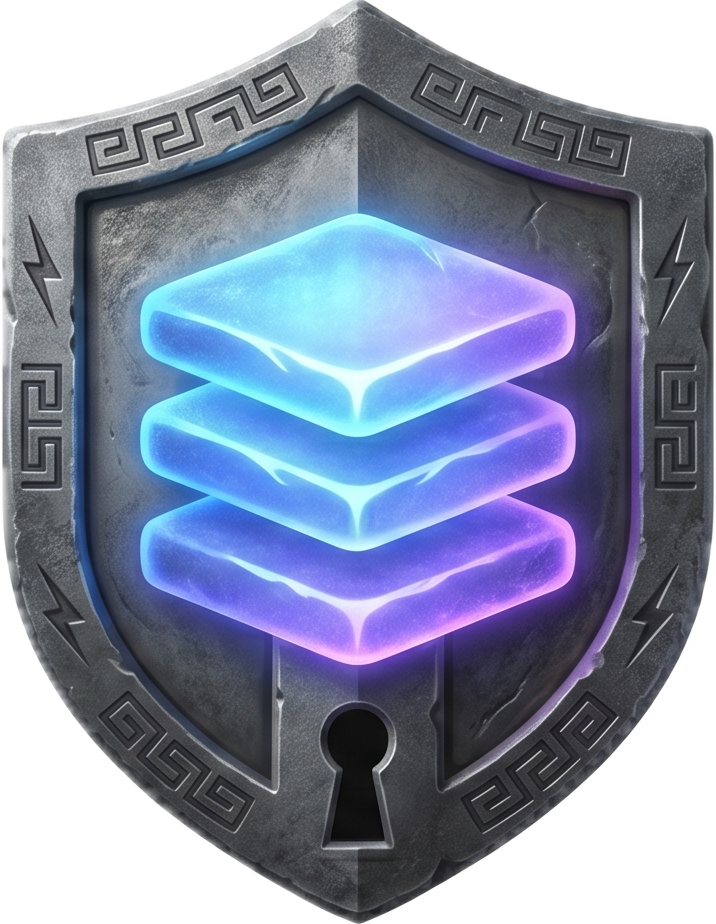

<p align="center">
  <!--  -->
  
</p>
<h1 align="center">Aegis</h1>
<p align="center">A self-hosted authentication and identity platform built in Rust. Headless by default, with the server and CLI as the primary interface for now.</p>
<br/>

<!--toc:start-->

- [Features](#features)
- [Requirements](#requirements)
- [Quick Start](#quick-start)
  - [Headless Server Setup (Recommended)](#headless-server-setup-recommended)
  - [Manual Setup](#manual-setup)
  - [Resetting Local Data](#resetting-local-data)
- [Commands and Options](#commands-and-options)
  - [`./dev.sh up`](#devsh-up)
  - [`./dev.sh down`](#devsh-down)
  - [`./dev.sh reset`](#devsh-reset)
  - [`cargo run --bin aegis -- ...`](#cargo-run---bin-aegis---)
- [How It Works](#how-it-works)
- [Architecture](#architecture)
- [Troubleshooting](#troubleshooting)
  - [Checking Logs](#checking-logs)
  - [Common Issues](#common-issues)
- [Development](#development)
  - [Building](#building)
  - [Dependencies](#dependencies)
- [Contributing](#contributing)
- [Support](#support)
- [License](#license)

<!--toc:end-->

## Features

- Password authentication with Argon2id
- WebAuthn passkeys
- TOTP MFA with recovery codes
- Session management with secure cookies and opaque bearer tokens
- Guest identity flows convertible into registered users
- Internal admin and operational APIs
- Immutable audit logging
- Reliable async email delivery via outbox pattern
- Headless server-first architecture

## Requirements

- Rust 1.85+
- Docker or compatible local container runtime
- PostgreSQL 15+
- Redis 7+

## Quick Start

### Headless Server Setup (Recommended)

1. Clone the repository:

   ```bash
   git clone https://github.com/junaadh/aegis.git
   cd aegis
   ```

2. Create your local environment file if needed:

   ```bash
   cp .env.example .env
   ```

3. Start local infrastructure and run migrations:

   ```bash
   ./dev.sh up
   ```

4. Start the server:

   ```bash
   cargo run --bin aegisd
   ```

That gives you a working headless Aegis server on your local machine. The dashboard is not part of the primary flow right now and can be added later.

### Manual Setup

If you prefer not to use `./dev.sh`:

1. Start Postgres, Redis, and Mailpit using the Compose file:

   ```bash
   docker compose --env-file .env -f infra/dev/compose.yml up -d
   ```

2. Run migrations:

   ```bash
   cargo run --bin aegis -- migrate up
   ```

3. Start the server:

   ```bash
   cargo run --bin aegisd
   ```

### Resetting Local Data

To wipe local Postgres and Redis data and reinitialize everything:

```bash
./dev.sh reset
```

## Commands and Options

### `./dev.sh up`

Start local services, wait for readiness, and run migrations.

```bash
./dev.sh up
```

### `./dev.sh down`

Stop local dev services.

```bash
./dev.sh down
```

### `./dev.sh reset`

Delete local service data volumes and rebuild the local environment.

```bash
./dev.sh reset
```

### `cargo run --bin aegis -- ...`

Use the CLI for migrations, config, schema generation, and token operations.

Examples:

```bash
cargo run --bin aegis -- migrate up
cargo run --bin aegis -- migrate status
cargo run --bin aegis -- config validate
cargo run --bin aegis -- schema --out schema.json
```

For help:

```bash
cargo run --bin aegis -- --help
```

## How It Works

1. `aegisd` exposes the HTTP API for signup, login, sessions, MFA, guests, and internal operations.
2. PostgreSQL stores users, sessions, credentials, audit logs, and pending tokens.
3. Redis is used as an optional cache and supporting runtime component.
4. The outbox pattern handles email delivery and other async jobs reliably.
5. The `aegis` CLI manages migrations, config, schema output, and operational tasks.

## Architecture

```text
bin/aegisd        HTTP server
bin/aegis         CLI for config, schema, tokens, migrations
crates/aegis-core Domain types and shared identity primitives
crates/aegis-app  Application layer and use cases
crates/aegis-db   PostgreSQL repositories and outbox support
crates/aegis-http HTTP handlers, middleware, routing
crates/aegis-infra Adapters for hashing, email, IDs, JWT, WebAuthn
crates/aegis-config Config loading, schema, validation
crates/aegis-migrate Migration runner
crates/aegis-cache Cache abstraction and Redis implementation
```

## Troubleshooting

### Checking Logs

- Server logs:

  ```bash
  cargo run --bin aegisd
  ```

- Docker service logs:

  ```bash
  ./dev.sh logs
  ```

- Logs for a single service:

  ```bash
  ./dev.sh logs postgres
  ./dev.sh logs redis
  ./dev.sh logs mailpit
  ```

### Common Issues

**Server fails to start:**

- Make sure Postgres is running
- Make sure Redis is running
- Check your `.env` values
- Run `cargo run --bin aegis -- config validate`

**Database connection errors:**

- Confirm your container runtime is up
- Re-run `./dev.sh up`
- If local state is broken, run `./dev.sh reset`

**Migrations fail:**

- Check migration status:

  ```bash
  cargo run --bin aegis -- migrate status
  ```

- Recreate the local database if needed:

  ```bash
  ./dev.sh reset
  ```

## Development

### Building

- Build the full workspace:

  ```bash
  cargo build --workspace
  ```

- Run tests:

  ```bash
  cargo test --workspace
  ```

- Run linting:

  ```bash
  cargo clippy --workspace -- -D warnings
  ```

### Dependencies

This project uses:

- Rust 2024 edition
- Tokio
- Axum
- SQLx
- PostgreSQL
- Redis
- Lettre
- WebAuthn RS

## Contributing

1. Fork the repository
2. Create a branch (`git checkout -b feature/my-change`)
3. Commit your changes (`git commit -m "Add my change"`)
4. Push the branch (`git push origin feature/my-change`)
5. Open a Pull Request

## Support

If you hit a bug or want to request a feature, open an issue on the repository.

## License

This project is licensed under the MIT License. See [LICENSE](LICENSE) for details.
